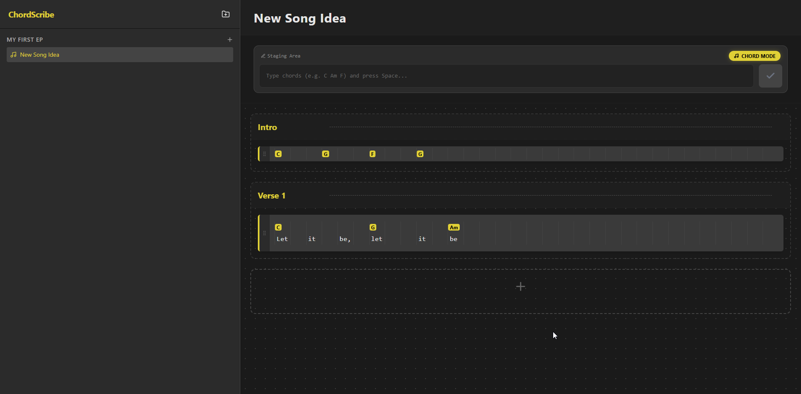

# ChordScribe (Rechorder & Lyrics)

A dark-themed, browser-based chord & lyrics editor. Organise your songs into folders, tag words with chords, reorder sections by drag-and-drop, and fine-tune chord positions with one click.

---

## Screenshot



---

## Features

- **Folder & song management** — create folders and songs in the left sidebar
- **Lyric Mode / Chord Mode** toggle — type lyrics normally or drop standalone chord blocks
- **Staging area** — build a line word-by-word (Space to commit a token, Enter to submit the section)
- **Paste support** — paste a full line; use `[Chord]word` or `word[Chord]` inline notation
- **Drag & drop** — reorder sections within or across parts; drag chords to repositon them on the grid
- **Part management** — add/rename/delete song parts (Intro, Verse, Chorus, etc.)
- **Gap token (`x`)** — insert a chord-only beat with no visible lyric

---

## Tech Stack

| Layer | Library |
|---|---|
| UI framework | React 18 |
| Icons | lucide-react |
| Styling | Tailwind CSS v3 |
| Bundler | Vite 5 |

---

## Getting Started

```bash
# Install dependencies
npm install

# Start the dev server
npm run dev
```

Then open [http://localhost:5173](http://localhost:5173) in your browser.

```bash
# Production build
npm run build
```

---

## Project Structure

```
├── index.html          # HTML entry point
├── index.py            # Original source (React JSX saved as .py)
├── screenshot.png      # App screenshot
├── src/
│   ├── App.jsx         # Main React component
│   ├── main.jsx        # React root renderer
│   └── index.css       # Tailwind base styles
├── tailwind.config.js
├── postcss.config.js
└── vite.config.js
```
